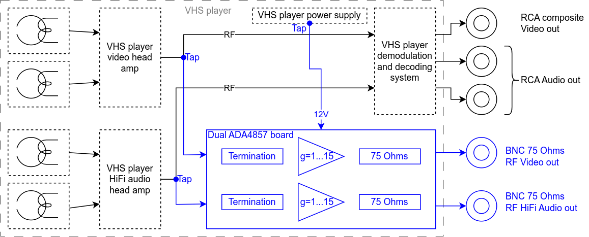

# A ADA4857 dual channel amplifier for VHS decode RF capture

 

An [ADA4857][ada4857-datasheet] based, configurable, dual channel amplifier and line driver for [VHS decode][vhs-decode].
The board is intended to be permanently mounted into a chosen VHS player, providing an amplified, 75 Ohms impedance output for the video and HiFi audio RF signals.
To build the amp you need to choose the appropriate components fitting for your VHS player, read on to find out more.

Find gerbers, BOM and pick'n'place files ready for fabrication over in the [releases section](https://gitlab.com/wolfre/vhs-rf-amp-ada4857/-/releases).
This project is a follow up / improvement on the [previous SGM8302 dual channel amplifier](https://gitlab.com/wolfre/vhs-rf-amp-sgm8302) of the same nature.

## Overview

The following diagram shows the intended usecase for this dual channel amplifier installed into a VHS player.
The Parts that will be installed into the VHS player, coming from this project are drawn in blue.

The design is based on two [ADA4857][ada4857-datasheet] single channel op amps, with a [DS8604-A0S3][ds8604-datasheet] 10V LDO and a few other passive components.
Both RF paths are identical and all the following discussion applies to path A and B equally.
The op amps are driven from a single 10V power supply (via an [LDO][wiki-ldo]), meaning the neutral / center voltage for the op amps is 5V.
Each of the amp inputs is being AC coupled into a termination resistor (a 1:1 divider to add the needed 5V DC offset) and will need to be selected according to you needs (see [build guide][self-build-guide]).
The op amps are used in a non-inverting design with a fixed gain factor, which also must be selected according to you needs (see [build guide][self-build-guide]).
The amp outputs have a DC block capacitor and 75 Ohms resistor in series, for the usual 75 Ohms impedance line and load to drive.
Mechanically the board is designed for [edge mount SMA connectors](https://www.google.com/search?q=sma+connector+edge+mount) but can also fit 2.54mm pin headers mounted sideways, or direct soldering.

## Build guide

This amp is intended to permanently mount into one specific VHS player and *adapt* the tape head amps RF signals to 75 Ohm lines / systems.
Each player is electrically different and so you will need to select a couple of components to match the amp board to your model.
The following guide will walk you through each step in details.
Before you start ordering and building, you should read the entire guide at least once so you know what to expect.
Here's an overview of the steps you will needed to do:
- [Order the amp boards with JLCPCB][ordering-guide-jlc] (most of the components come pre-assembled from the fab).
  You probably want to buy 4 edge mount SMA connectors, with about 6.5mm edge length.
  But you can also solder directly to the amp board or solder 2.54mm pin headers in lying flat on the board.
- Install a tap on the RF video and RF HiFi off the head amp from inside your player.
  As this is specific to your player model, only some general information is covered in this guide.
- Find a suitable power supply rail in your VHS player (something with at least 12V).
  And configure the amp boards power supply section to work with your chosen power rail.
  You may need to buy an additional [Zener diode][wiki-zener] for this step (see later details).
- Configure each amp paths input termination to match / work with the players head amps.
  You will need solder additional 0805 resistors to the amp board for this step (see later details).
- Configure each amp paths signal gain to deliver an signal level high enough to fit your capture device.
  You will need solder additional 0805 resistors to the amp board for this step (see later details).
- Mount the amp board into your VHS player and wire up suitable output connectors.
  As this is specific to your player model, this step is beyond the scope of this guide and will not be covered.

The adaption of the power supply, input termination and gain factors will require soldering.
Don't worry though all parts are either rather large 0805 SMD parts, or through hole.
If you are new to soldering electronics, learning about it is a bit beyond this guide.
However you may want to start looking here, as these videos cover the things needed for this guide:
- Branchus Creations Beginner's Guide to Soldering Electronics [Part 1](https://www.youtube.com/watch?v=M2Jf8cebwCs) and [Part 2](https://www.youtube.com/watch?v=BPuH1Z2npoQ)
- Electronoobs [SMD Soldering Tutorial | Guide | Tools | Tecniques | Stencil](https://www.youtube.com/watch?v=fYInlAmPnGo)

You will be dealing with high frequency analog signals, that need to be measured and observed to find the correct input termination and gain factor.
This requires either a [Digital storage oscilloscope][wiki-dso], or an [analog oscilloscope][wiki-scope] in good working order.
To correctly assess the signals, your scope should have an analog bandwidth of at least 20MHz, and you need high impedance probes as well
(1M or greater, usually the 10x setting on your oscilloscopes probes is a good fit).
This guide will assume you are familiar with oscilloscopes (if you are unsure have a look at GreatScott! [Everything you need to know when buying/using an Oscilloscope! EB#49](https://www.youtube.com/watch?v=d58GzhXKKG8)).

As evident from the steps above, you will need to know your way around your VHS player and a service manual will be of great help.

### Ordering the PCBs and additional components

The PCBs can currently be ordered from JLC, and come mostly pre-assembled.
See the [ordering guide over here][ordering-guide-jlc] for details on the ordering process.
The board is missing a few components that are specific to your VHS player.
Selecting them will be covered in subsequent sections, but here's a list of what you need (buy) in addition to the PCBs:
- 4x edge mount SMA connectors, with about 6.5mm edge length and about 1.6mm PCB thickness.
  Alternatively 4x 2.54mm pin headers with 3 connectors.
- Coax cable for taping the RF signals and bringing them to the amp board.
  Those cables are probably fitted with SMA connectors on one end, matching the edge mount SMA connector on the amp board.
- Additional (75 Ohms) coax cabling to bring the signal from the amp board to some connector accessible on the outside of your VHS player.
  The outside facing connector is most likely BNC, as 75 Ohms cables are readily available for these.
  The inside facing end will probably have a matching SMA connector to mate with the amp board outputs.
- Depending on your power supply situation inside the VHS player, a Zener diode is needed.
  See [power supply section][self-pwr] later on for details.
- A set of 0805 resistors to configure the input termination and gain setting on each amp path.
  See the [Adapting the amp inputs to your VHS player][self-adapt-input] and [Adapting the amp gain to your VHS player][self-adapt-gain] sections for details.
  However a common [0805 E24 resistor set with 1% tolerance][ebay-0805-r] is probably the cheapest option and should cover your needs.
- Generic insulated wire to supply power to the amp board.
  Optionally you can install pin header on the amp board instead of soldering the power supply directly.
- Anything needed to fixate / mount the amp board into your VHS player (e.g. M3 screws / nuts).
- Usual consumables like solder, heat shrink tubing etc.

### RF tap

When looking for an RF tap point, the goal is to be as close to the tape head amplifier outputs as possible.
The following diagram shows the logical components of a VHS RF tape pickup inside your player (both the RF video and HiFi RF audio paths will look similar).

The ideal tap point is right after the head switch, so that one RF signal contains both head outputs.
The newer your player the more components will be integrated in to complex ICs and may not be available separately.
Also there may be an additional set of video heads that is used for EP playback.

Look for your video and audio tap points and solder a well shielded coax cable to each one.
You don't need to add a DC block capacitor, as those are included on the amp boards.

### Power supply section

The board features an [DS8604-A0S3][ds8604-datasheet] LDO that supplies 10V to the two ADA4857 amps.
The input voltage can be from around 11V to 55V according to the data sheet.
However as any voltage dropped on the [LDO][wiki-ldo] is dissipated as heat, the higher the input voltage the hotter the IC will get.
To keep the temperature of the IC down to a reasonable level, the LDO input voltage should not exceed 20V.
A very common voltage to find in VHS player power supplies is 12V, which is an optimal fit.
If that is not available to you, higher voltages like 30V are also a common sight.
To make the board work with such higher voltages, a [Zener diode][wiki-zener] can be installed to drop the addition voltage.
When looking for a ground to power the board, make sure to double check that this is the same ground as the one from your head amp signal (multimeter reads 0 Ohm between the two grounds).

The above image shows the voltage input pins of connector J1 on the left.
This is where you connect the full input voltage from the VHS players power supply rail.
On the right C1 is visible, which is the input buffer capacitor before the LDO.
In the middle you can see the location for the optional [Zener diode][wiki-zener].

The total current draw of both [ADA4857][ada4857-datasheet] amps should be around 50mA.
So keep in mind that the [Zener diode][wiki-zener] you select must be able to dissipate the dropped voltage as heat.
The following table gives a quick overview on the selection of the diode, based on available input voltage.

| Vin (from PSU) | [Zener diode][wiki-zener] voltage rating | [Zener diode][wiki-zener] power rating |
|----------------|------------------------------------------|----------------------------------------|
| 12V            | no diode needed, short connections       |                                        |
| 20V            | 6~7 V diode recommended but not required | at least 0.5 W                         |
| 30V            | 10~15 V diode required                   | at least 1 W                           |
| 40V            | 20~25 V diode required                   | at least 2 W                           |

[Zener diodes][wiki-zener] are available with higher voltages, but this means ever more heat dissipation.
Instead you can also add an additional DC/DC step-down converter, that more efficiently produces the optimal 12V.
The [XL4015][xl4015-datasheet] IC is a good fit and can take up to 36V on its inputs.
Finished boards are cheaply and readily available on [ebay][ebay-xl4015] or other places.
These do however operate on a high frequency switching design (around 100~200kHz for the [XL4015][xl4015-datasheet]) and may introduce noise on the signal paths.
So you may want to think about shielding such a DC/DC converter.
You can take inspiration from the shielding of the PSU inside your VHS player as those usually are switch mode designs, that equally produce RF interference.

### Adapting the amp inputs to your VHS player

The inputs are AC coupled via C11 + R11 + R12 and C21 + R21 + R22.
Both caps are pre populated as 10µF, which should be good for any VHS player setup.
The resistors however are not populated from the factory, and need to be selected to work with the tape head amp output on [your RF tap][rf-tap].
Here's a rough guide on how to do this with some try'n'error (having a common resistor set at hand is a good idea).

Take a look at the service manual (if you have it), and look for resistors around the signal path you tapped.
Choose a value that is around 10x higher than the values you observe (e.g. 1.5k is around the signal path, go for a 15k Ohms resistor), but to be safe *don't go below 1k Ohms*.
If you don't have the service manual you can just start with about 100k Ohms.

Hook up a [DSO][wiki-dso] to the output of your tap and observe the signal levels.
Temporarily attach the chosen resistor value between signal and (analog) ground to see if the levels drop.
If they stay the same then repeat with a resistor value that is about half your current value, if they do drop, double the value.
You are looking for a value where the signal is just barely dropping, multiply that value by 20, that's your input termination.
This termination value is then be installed in both R11 and R12 positions (R21 and R22 respectively).

One of the signal paths is going to be for video, the other for audio.
As both path A and B are equal on the [ADA4857][ada4857-datasheet] amp board, it does not matter which path is used for what signal.
But you have to do the above try'n'error sequence for both head amps as they possibly differ.

### Adapting the amp gain to your VHS player

Once you have your input stage setup, you need to choose the gain for each signal path.
Make sure to observe the video and audio RF signal levels from your tap points with different VHS tapes.
Different tapes will have different signal levels (test newer and older tapes, NTSC and PAL, etc).
Consulting the service manual for your player may also give you a good idea about the expected signal levels.
Based on this you now need to choose the values for R13 + R14 (path A) and R23 + R24 (path B).

You should also know what your target capture device needs as a good input range.
A [CXADC](https://github.com/happycube/cxadc-linux3) seems to be [fine with about 1.5Vpp](https://gitlab.com/wolfre/cx25800-11z-cxadc-rework-measurements) (peak-to-peak).

So lets say you observe 0.5Vpp (500mVpp) of signal level and your device is a CX based capture card, so a target of 1.5Vpp.
This means we need 6x gain, here's why: from 0.5V to 1.5V is a 3x gain, but you also need to have [2x for the transmission line](https://electronics.stackexchange.com/questions/550000/50-ohms-output-termination-for-a-50ohms-load), 2 x 3 gives a gain of 6.
The following tables lists good combinations for the resistor pairs from the [E12](https://en.wikipedia.org/wiki/E_series_of_preferred_numbers) series.
In doubt select the next lower gain to get more headroom on the ADC input.

|Rf (Ohms) | Rin (Ohms) | gain | Est. bandwidth (MHz)|
|----------|------------|------|---------------------|
| 560      | 560        |  2   | 350                 |
| 560      | 270        | 3.0  | 180                 |
| 560      | 180        | 4.1  | 120                 |
| 560      | 150        | 4.7  | 95                  |
| 560      | 120        | 5.6  | 75                  |
| 560      | 100        | 6.6  | 60                  |
| 560      |  82        | 7.8  | 55                  |
| 560      |  68        | 9.2  | 45                  |
| 560      |  56        | 11.0 | 35                  |
| 560      |  47        | 12.9 | 30                  |
| 560      |  39        | 15.4 | 25                  |

The bandwidth estimations are based on an extrapolation for the couple values from the data sheet.
They are only rough guidelines and don't take into account anything but the amp IC.
So no tap point quality, PCB design, connector losses, cabling limits, etc.

The above table lists Rf and Rin values, the mapping is as follows:
- Path A
  - Rf = R14
  - Rin = R13
- Path B
  - Rf = R24
  - Rin = R23

As mentioned previously the design of the board fits a 75 Ohms impedance / transmission line and termination.
This is the default found on CX based capture cards and in other video based applications.
However this can be changed to 50 Ohms by replacing the series resistors R15 and/or R24 with a 50 Ohms 0603.
You can either do this by editing the BOM when ordering, or simply replace them afterwards if needed.

## Final words

**TODO**

## Changelog

See [CHANGELOG.md](CHANGELOG.md).

## Releases

See [releases](https://gitlab.com/wolfre/vhs-rf-amp-ada4857/-/releases) for PCB gerbers, BOM and pick'n'place files ready for fabrication.

# License

[ada4857-datasheet]: https://www.analog.com/media/en/technical-documentation/data-sheets/ADA4857-1_4857-2.pdf
[ds8604-datasheet]: https://jlcpcb.com/partdetail/Dstech-DS8604A0S3/C5884205
[self-build-guide]: #build-guide
[self-pwr]: #power-supply-section
[self-adapt-input]: #adapting-the-amp-inputs-to-your-vhs-player
[self-adapt-gain]: #adapting-the-amp-gain-to-your-vhs-player
[ordering-guide-jlc]: order-jlc/ordering-guide.md
[wiki-dso]: https://en.wikipedia.org/wiki/Digital_storage_oscilloscope
[wiki-scope]: https://en.wikipedia.org/wiki/Oscilloscope
[rf-tap]: https://github.com/oyvindln/vhs-decode/wiki/Hardware-Installation-Guide
[wiki-zener]: https://en.wikipedia.org/wiki/Zener_diode
[ebay-0805-r]: https://www.ebay.com/sch/i.html?_nkw=0805+smd+resistor+kit
[ebay-xl4015]: https://www.ebay.com/sch/i.html?&_nkw=XL4015+step+down
[wiki-ldo]: https://en.wikipedia.org/wiki/Low-dropout_regulator
[xl4015-datasheet]: https://datasheet.lcsc.com/lcsc/1811081616_XLSEMI-XL4015E1_C51661.pdf
