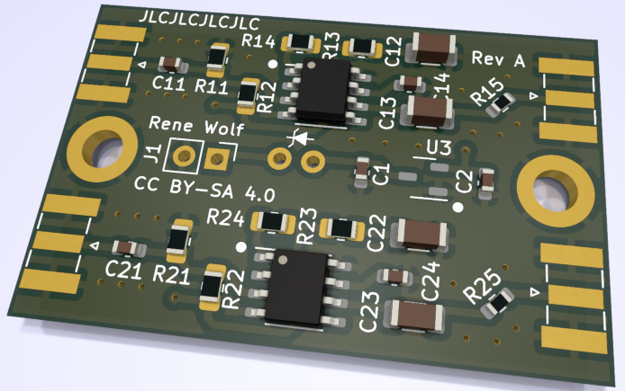
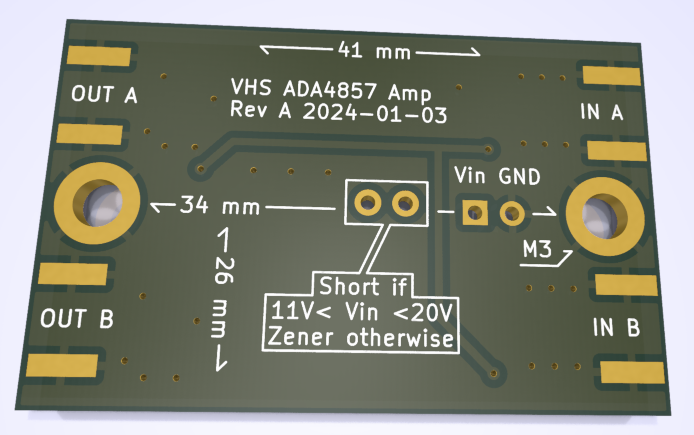

# A ADA4857 dual channel amplifier for VHS decode RF capture

An [ADA4857][ada4857-datasheet] based, configurable, dual channel amplifier and line driver for [VHS decode][vhs-decode].
The board is intended to be permanently mounted into a chosen VHS player, providing an amplified, 75 Ohms impedance output for the video and HiFi audio RF signals.
To build the amp you need to choose the appropriate components fitting for your VHS player, read on to find out more.

Find gerbers, BOM and pick'n'place files ready for fabrication over in the [releases section](https://gitlab.com/wolfre/vhs-rf-amp-ada4857/-/releases).
This project is a follow up / improvement on the [previous SGM8302 dual channel amplifier](https://gitlab.com/wolfre/vhs-rf-amp-sgm8302) of the same nature.

## Overview

The design is based on two [ADA4857][ada4857-datasheet] single channel op amps, with a [DS8604-A0S3][ds8604-datasheet] 10V LDO and a few other passive components.
Both RF paths are identical and all the following discussion applies to path A and B equally.
The op amps are driven from a single 10V power supply (via the [DS8604-A0S3][ds8604-datasheet] LDO), meaning the neutral / center voltage for the op amps is 5V.
Each of the amp inputs is being AC coupled into a termination resistor (a 1:1 divider to add the needed 5V DC offset) and will need to be selected according to you needs (see [build guide][self-build-guide]).
The op amps are used in a non-inverting design with a fixed gain factor, which also must be selected according to you needs (see [build guide][self-build-guide]).
The amp outputs have a DC block capacitor and 75 Ohms resistor in series, for the usual 75 Ohms impedance line and load to drive.
Mechanically the board is designed for [edge mount SMA connectors](https://www.google.com/search?q=sma+connector+edge+mount) but can also fit 2.54mm pin headers mounted sideways, or direct soldering.

## Build guide

This amp is intended to permanently mount into one specific (VHS) player (or other similar device) and *adapt* the tape head RF signals to 75 Ohms lines / systems.
Each player is electrically different and so you will need to select a couple of components to match your model.
How you mount / fixate the board (in)to your player is beyond this guide, but for reference it measures about 41mm x 26mm and has 2 M3 (3.2mm) mounting holes.

The following guide will walk through each step in details.
Before you start ordering and building, you should read the entire guide at least once so you know what to expect.
Here's an overview of the steps you will needed to do:
- Order the amp boards with [JLCPCB][ordering-guide-jlc], most of the components come pre-assembled from the fab.
- Tap the RF video and RF HiFi off the head amp from the VHS player.
- Find a suitable power supply rail in your VHS player (something with at least 12V).
- Configure the amp boards power supply section to work with your chosen power rail.
- Configure each amp paths input termination to match / work with the players head amps.
- Configure each amp paths signal gain to deliver an signal level high enough to fit your capture device.
- Mount the amp board into your VHS player and wire up suitable output connectors.
  As this is specific to your player model, this step is beyond the scope of this guide.

As noted above you will need to know your way around your VHS players and a service manual will be of great help.
The adaption of the power supply, input termination and gain factors will require soldering.
Don't worry though all parts are either rather large 0805 SMD parts, or through hole.

If you are new to soldering electronics, learning about it is a bit beyond this guide.
However you may want to start looking here, as these videos cover the things needed for this guide:
- Branchus Creations Beginner's Guide to Soldering Electronics [Part 1](https://www.youtube.com/watch?v=M2Jf8cebwCs) and [Part 2](https://www.youtube.com/watch?v=BPuH1Z2npoQ)
- Electronoobs [SMD Soldering Tutorial | Guide | Tools | Tecniques | Stencil](https://www.youtube.com/watch?v=fYInlAmPnGo)

You will be dealing with high frequency analog signals, that need to be measured and observed to find the correct input termination and gain factor.
This requires either a [Digital storage oscilloscope][wiki-dso], or an [analog oscilloscope][wiki-scope] in good working order.
To correctly assess the signals, your scope should have an analog bandwidth of at least 20MHz, and you need high impedance probes as well (1M or greater, commonly the 10x setting).

### Ordering the PCBs

**TODO**

### RF tap

**TODO**

### Power supply section

**TODO**

### Adapting the amp inputs to your VHS player

**TODO**

### Adapting the amp gain to your VHS player

**TODO**

## Final words

**TODO**

## Changelog

See [CHANGELOG.md](CHANGELOG.md).

## Releases

See [releases](https://gitlab.com/wolfre/vhs-rf-amp-ada4857/-/releases) for PCB gerbers, BOM and pick'n'place files ready for fabrication.

# License

[ada4857-datasheet]: https://www.analog.com/media/en/technical-documentation/data-sheets/ADA4857-1_4857-2.pdf
[ds8604-datasheet]: https://jlcpcb.com/partdetail/Dstech-DS8604A0S3/C5884205
[self-build-guide]: #build-guide
[ordering-guide-jlc]: order-jlc/ordering-guide.md
[wiki-dso]: https://en.wikipedia.org/wiki/Digital_storage_oscilloscope
[wiki-scope]: https://en.wikipedia.org/wiki/Oscilloscope
[rf-tap]: https://github.com/oyvindln/vhs-decode/wiki/Hardware-Installation-Guide
