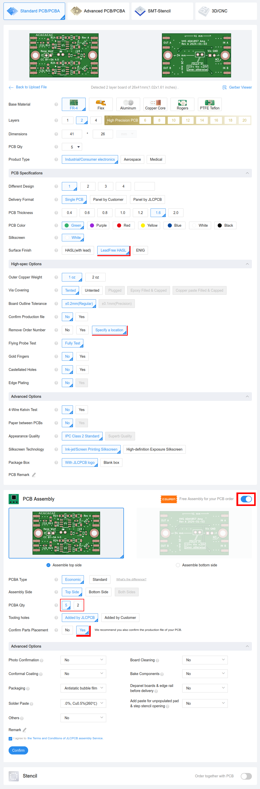
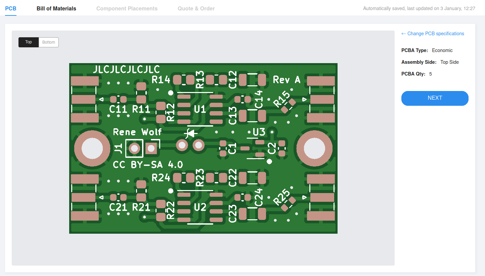
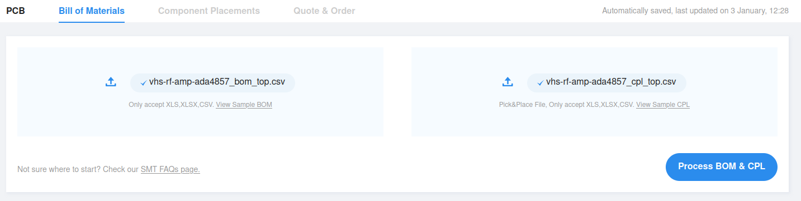
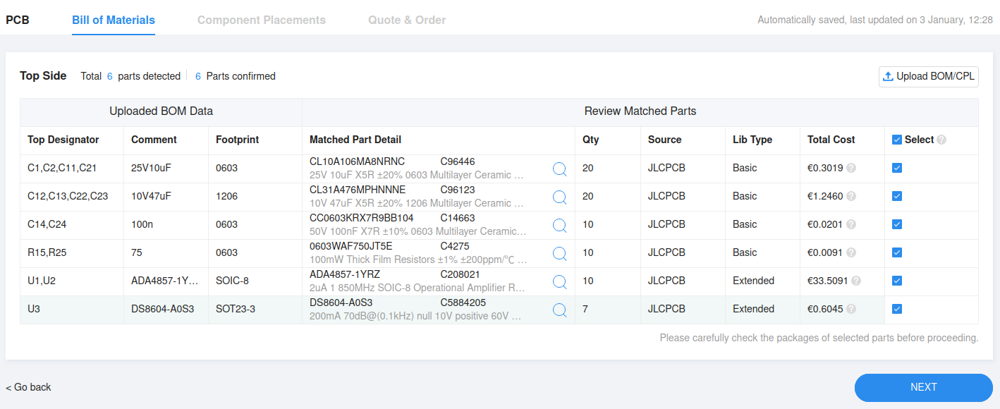
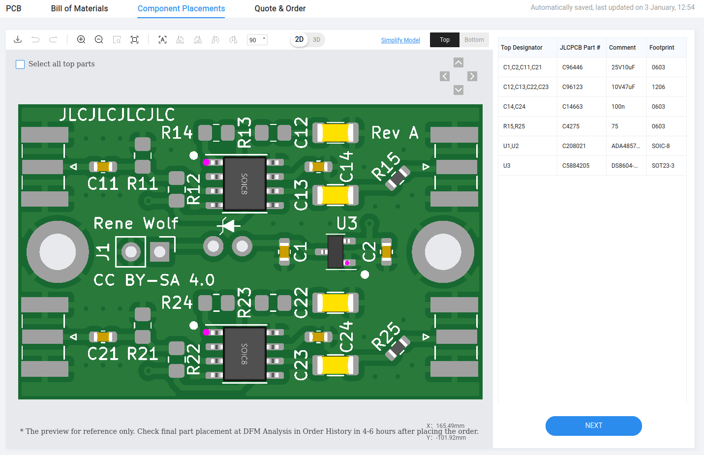

# [JLCPCB][jlcpcb] ordering guide Jan. 2024

The following steps should walk you through the ordering process.
When done you will have ordered the PCB fabrication and partial SMT assembly.
The details may change over time as [JLCPCB][jlcpcb] adapts their webpage and the information shown here is valid as of Jan. 2024.

## Steps

Start by going to their instant quote page and upload the gerbers zip file.
Next select the options as shown in the below image.
Make sure to choose "Lead free HASL", "Specify Location", and "Confirm Parts Placement" (all marked in red in the image).
Also choose the number of PCBs you want to populate.

After that is done you can press the blue "Next" buton on the right side panel.
The next page shows you the top and bottom PCB once more.

Press the blue "Next" button again to get to the BOM and CPL upload as seen in the next image.

Select the respective CVS files and press the blue "Process BOM & CPL" button.
JLC now parses the CSVs and looks up the parts in their inventory systems (may take a few seconds).
The next page shows you the results of this BOM matching process.

It may be that some parts are not found and you need to manually search for and select them from stock.
This is offered on that page, inline in the table for the specific component.
If components are out of stock they need to be pre-ordered here.
In the above image all parts could be matched, U3 is gree tinted as I had to manually select it.
When all parts are filled you can press the blue "Next" button again to get to the parts placement.

This page shows a rendering of the boards with components populated.
You can now interactively change the orientation of each part if it does not match the board.
Note how the purple dots on ICs denote JLCs orientation for pin 1, and those must line up with the silkscreen markings on the PCB.
The CPL CSV file should fully match the above image without manual adjustments.
You should download a PNG for later referencing (the download icon on the top left).
As you ordered "Confirm Parts Placement", this placement will be checked once more by JLC and corrected if needed for some reason.

Pressing the blue "Next" button again will get you to the payment details and checkout page.
Depending on where you want to ship your PCBs you may need to select a customs tariff, you can look up the [EU ones here](https://www.tariffnumber.com).
Finish the checkout, select shipping options, add any coupons and pay.

Within a few minutes after paying, you should get an "Approval mail" for both the PCB fab and the SMT order.
In the next half day after that you will get another mail that contains the results of the parts placement review process.
Production is on hold untill you confirm or reject JLCs suggestion.
Be sure to check your inbox, there is a time window of about 3 days to do so!
After that you are done and only have to wait for your shipment.

[jlcpcb]: https://jlcpcb.com
